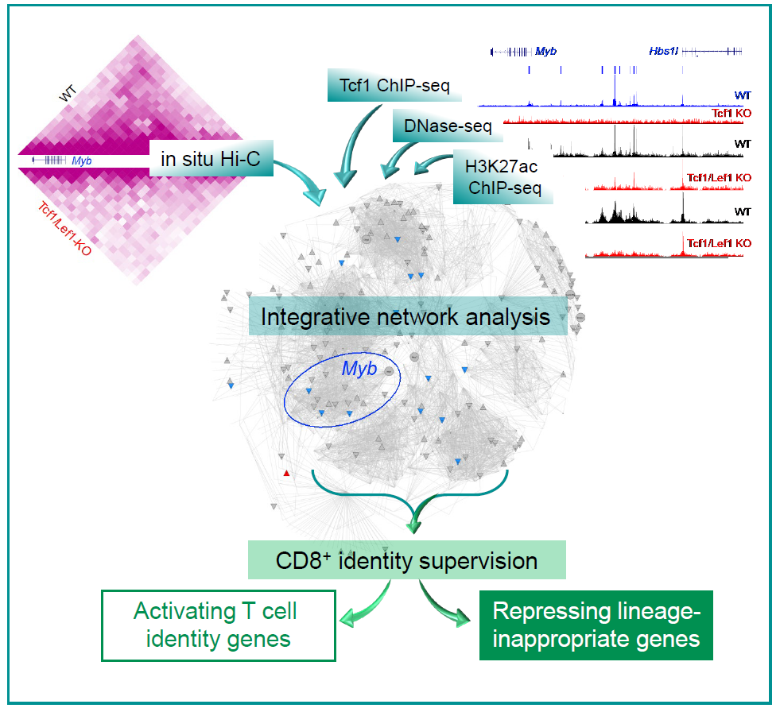

# CD8_HP
## T cell identity is established during thymic development, but how it is maintained in the
periphery remains unknown. Here we show that ablating Tcf1 and Lef1 transcription factors in
mature CD8+ T cells aberrantly induces genes from non-T cell lineages. The integrative mechanisms utilized by Tcf1/Lef1 underlie activation of T cell
identity genes and repression of non-T lineage genes, conferring fine control of various T cell
functionalities. These findings suggest that Tcf1/Lef1 control global genome organization and
help form intricate chromatin-interacting hubs to facilitate promoter-enhancer/silencer contact,
hence providing constant supervision of CD8+ T cell identity and function.

### paper & data accession
RNA-seq, ChIP-seq, DNase-seq and HiC-seq are deposited in GEO under the accession number [GSE164713](https://www.ncbi.nlm.nih.gov/geo/query/acc.cgi?acc=GSE164713)
### UCSC genome browser session
UCSC genome browser view of processed data(excluded HiC) can be found [here](https://genome.ucsc.edu/s/lux563624348/CD8%2DHP).
Trackhub file can be found 

[Expression RNA_seq](https://xianglilab.s3.amazonaws.com/tracks_hub/Haihui/CD8-HP/mm9/trackDb.txt)

[ChIP_seq Tcf1](https://xianglilab.s3.amazonaws.com/tracks_hub/Haihui/CD8-HP-ChIP_seq_Macs2/mm9/trackDb.txt)

[DNase_seq](https://xianglilab.s3.amazonaws.com/tracks_hub/Haihui/CD8-HP-DNaseseq/mm9/trackDb.txt)

[ChIP_seq K27ac](https://xianglilab.s3.amazonaws.com/tracks_hub/Haihui/CD8-HP-K27ac/mm9/trackDb.txt)

### Epigenome Browser session
Epigenome genome browser view of all the processed data can be loaded with

[Hub file](https://github.com/lux563624348/Bioinformatics/blob/master/Archive/Paper_Summary/Haihui/eg-hub-CD8-HP.json)

[Session File](https://github.com/lux563624348/Bioinformatics/blob/master/Archive/Paper_Summary/Haihui/CD8-HP-pooled_HiC_version.json)

### processed files (genome version: mm9)
Expression profiling by high throughput sequencing
Genome binding/occupancy profiling by high throughput sequencing
[GEO](https://www.ncbi.nlm.nih.gov/geo/query/acc.cgi?acc=GSE164713) 
