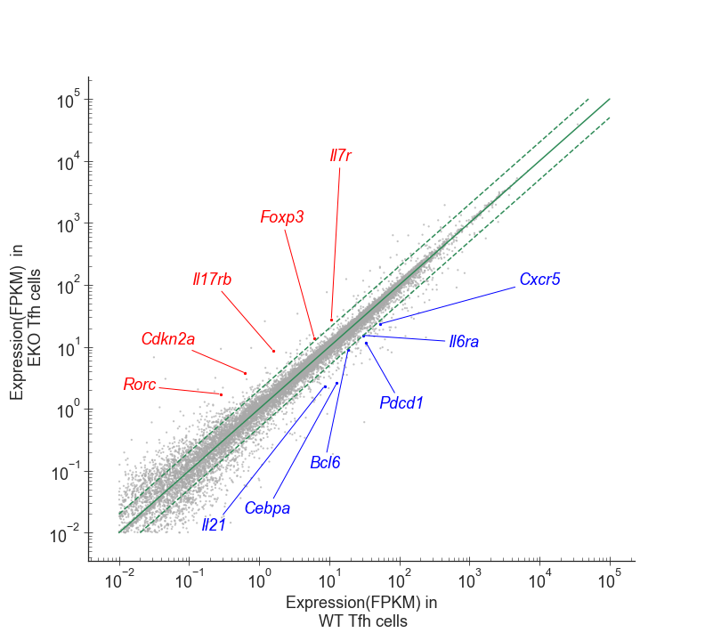
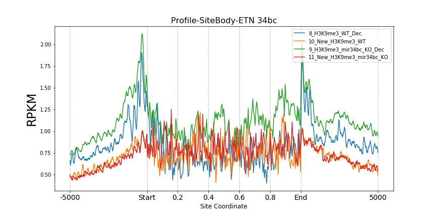
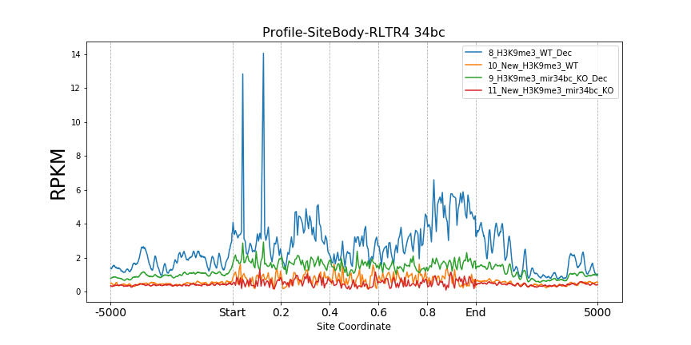
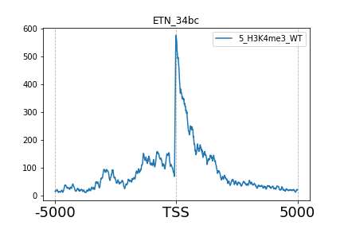
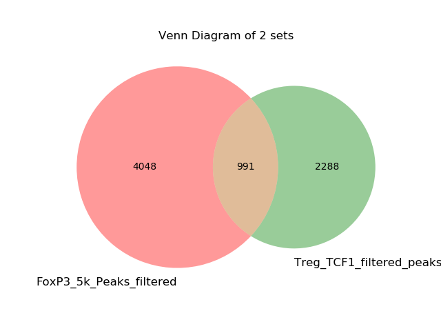

This folder is all about the codes and small tools for bioproject.


# Bioproject-Code-Pool
Collection of code for genomic data analysis (mainly for [RNA-Seq](https://en.wikipedia.org/wiki/RNA-Seq) and [ChIP-Seq](https://en.wikipedia.org/wiki/ChIP-sequencing) data)

The code is used in the following papers:

### Template
>[1]  Qiang Shan*, **Zhouhao Zeng\*,** Shaojun Xing, Fengyin Li, Stacey M. Hartwig, Jodi A. Gullicksrud et al. 
"[The transcription factor Runx3 guards cytotoxic CD8+ effector T cells against deviation towards follicular helper T cell lineage.](http://www.nature.com/ni/journal/v18/n8/full/ni.3773.html)" *Nature Immunology* 18, no. 8 (2017): 931-939.
***\*contributed equally***

## Profile
Only with One Command to do the following:
Generating profile of [histone marks](https://www.whatisepigenetics.com/histone-modifications/generate_profile_around_locations_for_all_beta.py) at specific sets of genomic landmarks.

#### [`generate_profile_TSS_GeneBody_TES.py`](python_tools/Histone_Mark_Profile/generate_profile_TSS_GeneBody_TES_beta.py)

**Usage:** generating profile or histone marks around gene [TSS](https://en.wikiversity.org/wiki/Gene_transcriptions/Start_sites).

**Example:** from paper [[2]](#bioinformatics-codebase)








# Below this line are template from zz

#### [`generate_profile_around_sites.py`](profile/generate_profile_around_sites.py)

**Usage:** generating profile of histone marks around [transcription factor](https://en.wikipedia.org/wiki/Transcription_factor) binding sites.

**Example:** from paper [[2]](#bioinformatics-codebase)


#### [`generate_profile_around_summits.py`](profile/generate_profile_around_summits.py)

**Usage:** generating profile of histone marks around transcription factor binding sites aligned by their summits.

**Example:** from paper [[1]](#bioinformatics-codebase)


#### [`generate_profile_matrix_around_summits.py`](profile/generate_profile_matrix_around_summits.py)

**Usage:** generating matrix of profiles around transcription binding sites. One profile for each binding site, organized as a heatmap.

**Example:** from ongoing project


## enhancer
Finding [enhancers](https://en.wikipedia.org/wiki/Enhancer_(genetics)) from histone modification data.

#### [`find_enhancer.py`](enhancer/find_enhancer.py)

**Usage:** Identifying active, primed, poised enhancers from histone modification peaks.

**Dependencies:** `bedtools` needs to be pre-installed.

## genomic distribution
Obtaining the genomic distribution of peaks and their associated genes.

#### [`peaks_genomic_distribution.py`](genomic_distribution/peaks_genomic_distribution.py)

**Usage:** Counting the number of peaks located in different genomic region ([promoter](https://en.wikipedia.org/wiki/Promoter_(genetics)), [gene body](https://socratic.org/questions/what-is-a-gene-body), and [intergenic region](https://en.wikipedia.org/wiki/Intergenic_region)).
if a peak is located in the promoter or gene body of a specific gene, record its associated gene.

**Example:**

stdout:

`Number of peaks in TSS region is 1920, number of peaks in promoter is 98, number of peaks in gene body is 425, and number of peaks in intergenic region is 335.`

output file:

```
chrom   start           end             genic_region
chr1    6204000         6205599         TSS_region Rb1cc1
chr1    7078600         7079899         TSS_region Pcmtd1
chr1    16093900        16095699        TSS_region Rdh10
chr1    16608700        16609699        TSS_region Ube2w
chr1    34898600        34900599        TSS_region Fam168b
chr1    36322000        36323499        gene_body Neurl3
chr1    36364100        36367599        TSS_region Arid5a
chr1    36527900        36529499        TSS_region Cnnm4
```

## read count
Obtaining the reads distribution of histone marks at specific sets of genomic landmarks.

#### [`get_read_count_on_genomic_region.py`](read_count/get_read_count_on_genomic_region.py)

**Usage:** Getting the reads distribution of histone marks at genomic landmarks (i.e. promoter, gene body) of a given gene list.

**Example:**

output file:

```
gene_id         read_count      RPKM            RPKM_with_pseudo_count
9930014A18Rik   0               0.0             0.0111453327533
AA467197        0               0.0             0.0136666098393
Abcg2           0               0.0             0.00273733530983
Acsbg1          384             1.58280916587   1.58693106474
Adam8           1002            9.45914868155   9.46858894969
Adamts14        670             2.20438939296   2.20767952638
Afp             0               0.0             0.00829786569023
Akap1           0               0.0             0.00589141522767
```
